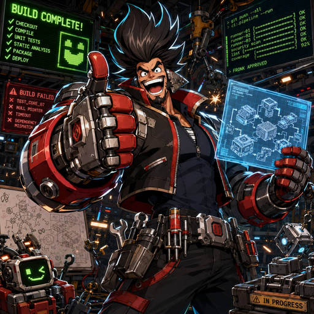

<div align="center">

# 🌀 Superloopy

**Ingeniería de bucles para Codex.** Escribe `loopy <task>`: un agente hace el trabajo, prueba cada parte con evidencia real y solo entonces dice que terminó.

<p>
  <a href="README.md">English</a> ·
  <a href="README.ko.md">한국어</a> ·
  <a href="README.zh-CN.md">中文(简体)</a> ·
  <a href="README.ja.md">日本語</a> ·
  <a href="README.es.md">Español</a>
</p>

&nbsp;&nbsp;&nbsp;&nbsp;&nbsp;

<sub><b>the crew</b> — subagentes opcionales, un trabajo cada uno</sub>

</div>

## Uso

Después de instalarlo, escribe tu tarea en Codex con `loopy` al inicio:

```
loopy corrige la prueba de inicio de sesión que falla y verifícala con evidencia
```

El agente la planifica, prueba cada parte con un archivo real y responde con el resultado. No tienes que ejecutar comandos manualmente. El Stop hook incluido se queda inactivo salvo que `SUPERLOOPY_STOP_HOOK=on`.

## Skills

Superloopy mantiene pequeña la capa de comandos. Las skills guardan el flujo especializado: cuándo usarlas, qué revisar y qué prueba debe quedar en `.superloopy/evidence/`.

| Skill | Cuándo usarla | Qué produce |
| --- | --- | --- |
| `superloopy-loop` | Usa `loopy <task>` o `loopy team <task>` para un loop completo; usa `loopywork`, `lpy` o `$lpy` solo para guidance. | Un loop completo produce un plan ligero, siguientes acciones, prueba respaldada por comandos, un quality gate y un evidence report final. Los alias de guidance no mutan estado. |
| `superloopy-research` | Pides `loopy research`, deep research, exhaustive investigation o un informe con citas. | Ejes de investigación, expansion waves, claim ledger, notas de verificación y un synthesis artifact citado. |
| `superloopy-clone` | Pides `loopy clone`, clonación autorizada de un sitio, reconstrucción, migración o recuperación visual precisa. | Capturas de navegador, topología de página, design tokens, inventario de assets, notas de implementación, salida de build y evidencia de visual QA. |

La skill de loop es la barandilla por defecto. `loopy` inicia o reanuda el evidence loop; `loopy team` sube a crew mode. `loopywork`, `lpy` y `$lpy` solo inyectan guidance inicial. Research y clone son modos especializados opt-in, y ambos terminan registrando Superloopy evidence en lugar de confiar en una frase de estado.

## Demo de clonación

[](https://transferloom.com/)

`superloopy-clone` reprodujo Transferloom.com en local y pasó validación de navegador desktop/mobile. La ejecución de referencia conservó sticky nav, animated hero, app preview sections, comparison table, security panel, sister app banner, footer, local assets y el Superloopy evidence trail.

## Crew

Para trabajos grandes, Superloopy incluye seis subagentes opcionales en `.codex/agents/`, cada uno con una línea de trabajo. Se instalan automáticamente con el plugin; `superloopy agents install` solo vuelve a copiarlos si lo necesitas. Los valores de modelo recomendados están en `docs/superloopy-model-policy.md` y `superloopy doctor` los verifica.

<table>
  <tr>
    <td align="center" width="33%"><br /><b>fronk</b><br /><sub>construye</sub></td>
    <td align="center" width="33%"><br /><b>zyro</b><br /><sub>revisa</sub></td>
    <td align="center" width="33%"><br /><b>usk</b><br /><sub>prueba</sub></td>
  </tr>
  <tr>
    <td align="center"><br /><b>jumbo</b><br /><sub>valida el gate</sub></td>
    <td align="center"><br /><b>rovyn</b><br /><sub>audita</sub></td>
    <td align="center"><br /><b>nomi</b><br /><sub>encuentra</sub></td>
  </tr>
</table>

Invoca la crew con `loopy team <task>`. También puedes usar `loopy crew`, la forma de una palabra `loopycrew`, o `ultrawork <task>`. Superloopy reparte el trabajo en líneas paralelas y aun así exige prueba para cada parte antes de marcarlo como terminado. Un `loopy <task>` normal se queda en modo solo y delega únicamente cuando las partes son claramente independientes.

En ejecuciones con la crew completa, el padre registra cada línea con `superloopy loop handoff`, revisa `superloopy loop fleet --json` y mantiene separado el informe final humano del gate JSON de máquina. Un informe de gate puede ser evidencia Markdown; `superloopy loop finish --artifact` espera un gate de calidad `.json`.

Cuando un handoff de crew termina, Superloopy puede imprimir una línea original de crew antes del estado normal de `handoff` o `fleet`. Sigue el idioma detectado en la asignación o el brief del scope cuando está soportado, y vuelve al inglés si no. La línea solo da personalidad; el verdict, el evidence artifact, la lista outstanding y la lista attention siguen siendo la autoridad.

## Instalación

Requiere Node.js 20 o superior y Codex CLI 0.131.0 o superior para `codex plugin add`. Superloopy no tiene dependencias de runtime.

```
codex plugin marketplace add https://github.com/beefiker/superloopy
codex plugin add superloopy@beefiker
```

Reinicia Codex después de instalar el plugin. Si Codex te pide revisar hooks, apruébalos; la siguiente sesión aprobada ejecuta un hook `SessionStart` una sola vez para instalar el comando `superloopy` y los agents. Si `superloopy` no aparece, su carpeta no está en tu `PATH`; el bootstrap imprime la línea exacta que debes agregar. Revisa todo con `superloopy doctor`.

Si instalas desde un checkout, ejecuta `node src/cli.js install --json`.

## Actualización

Si instalaste desde el Codex marketplace, actualiza el marketplace snapshot:

```
codex plugin marketplace upgrade beefiker
```

Superloopy revisa actualizaciones en `SessionStart`. Las instalaciones desde marketplace las gestiona Codex, así que Superloopy no inicia un self-update con `npx`; si detecta una versión nueva, te indicará ejecutar el marketplace upgrade y volver a aprobar los hooks Modified.

Reinicia Codex después de actualizar. Si los hooks aparecen como Modified, es esperado; vuelve a aprobarlos y la siguiente sesión aprobada ejecutará el bootstrap `SessionStart` con la versión nueva. Después ejecuta `superloopy doctor`.

Si el plugin todavía parece viejo o sigue degradado, haz un repair reinstall desde el marketplace actualizado:

```
codex plugin add superloopy@beefiker
```

Si instalaste desde un checkout, actualiza el checkout y vuelve a ejecutar el installer:

```
git pull --ff-only
node src/cli.js install --json
superloopy doctor
```

Las instalaciones desde checkout no están gestionadas por `npx`. El self-update con `npx` queda reservado para un instalador futuro que escriba un snapshot `superloopy-install.json` en una raíz de instalación estable.

## Solución de problemas

Si fallan los comandos de instalación o actualización del plugin, actualiza primero el Codex CLI. `codex plugin add` está disponible desde Codex CLI 0.131.0; las versiones antiguas del Codex CLI pueden tener problemas con los comandos actuales de plugin marketplace y la aprobación de hooks.

Después de actualizar el CLI, reinicia Codex, vuelve a ejecutar el comando de instalación o actualización del marketplace, aprueba cualquier hook Modified y revisa con `superloopy doctor`.

## Desinstalación

Elimina el plugin instalado de Codex:

```
codex plugin remove superloopy@beefiker
```

Si ya no necesitas el marketplace source, elimínalo también:

```
codex plugin marketplace remove beefiker
```

Reinicia Codex después de desinstalar. Optional local bootstrap cleanup: eliminar el plugin cubre la config y cache de plugins de Codex, pero el wrapper `superloopy` y los agents copiados en tu directorio personal pueden quedar. Revísalos antes de borrarlos, sobre todo si personalizaste algún agent.

```
rm -f ~/.local/bin/superloopy
rm -f ~/.codex/agents/fronk.toml ~/.codex/agents/zyro.toml ~/.codex/agents/usk.toml ~/.codex/agents/jumbo.toml ~/.codex/agents/rovyn.toml ~/.codex/agents/nomi.toml
```

Si instalaste con `CODEX_HOME`, `SUPERLOOPY_BIN_DIR` o `CODEX_LOCAL_BIN_DIR`, limpia esas rutas configuradas.

<sub>Licencia MIT.</sub>
